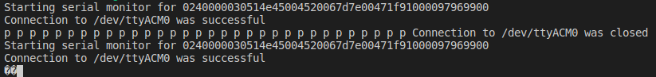
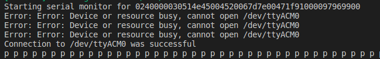

# node serial monitor

This is a simple project to test serial port connection on node.

More specifically this project is used here to test a possible issue with the npm package [`serialmonitor`](https://www.npmjs.com/package/serialport) on Ubuntu 18.04.

## How to use
To run the repo use:

`npm start`

After that, connect a device which outputs something to the serial monitor. The connecton to the serial monitor is open successfully, but no data is coming through or the data coming from the device is garbled.

To run a possible fix use:

`npm start -- --timeout=2000`

When connecting a device, the connection should not be immediately successful. After a few attempt to reconnect the connection is established successfully. This can take some considerable time, 30 seconds in my case. After this the data coming to the serial is correct.

